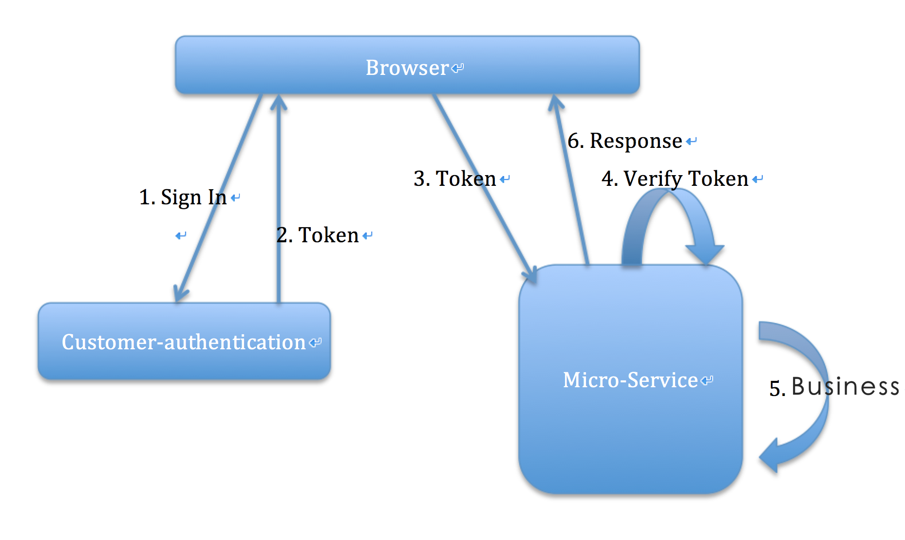

# customer-authentication service
[](https://travis-ci.org/reactivesw/customer-authentication)

[](https://codecov.io/gh/reactivesw/customer-authentication)

# 1 Introduction
customer authentication service, provide: sign in, sign up, sign out, generate customer token.

# 2. Build & Run
## 2.1 Build
- clone & build the project
```Shell
 git clone https://github.com/reactivesw/customer-authentication.git
 cd customer-authentication
 ./gradlew clean build
```
## 2.2 Run
- Use gradle
```Shell
./gradlew run
```
- Use Java, in this way, you should build the project first.
```Shell
java -jar build/libs/customer-authentication-{jar-version}.jar
```

# 3. Features
- Use JWT to generate customer token. and the token contains such messages:
```Json
{
  "tokenType" : "", // could be anonymous, customer
  "subjectId" : "", // could be anonymous id, customerid
  "generateTime" : ,
  "expiresIn" : ,
  "scope" : ""
}
```
- The `SignatureAlgorithm.HS512` for sign the token
- All customer id will be generate here.

# 4. Design


# 5. Dependency
This project depend on config service, but you can still run it dependently by add all the configs need to application.yml.


